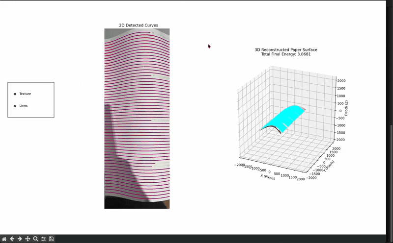
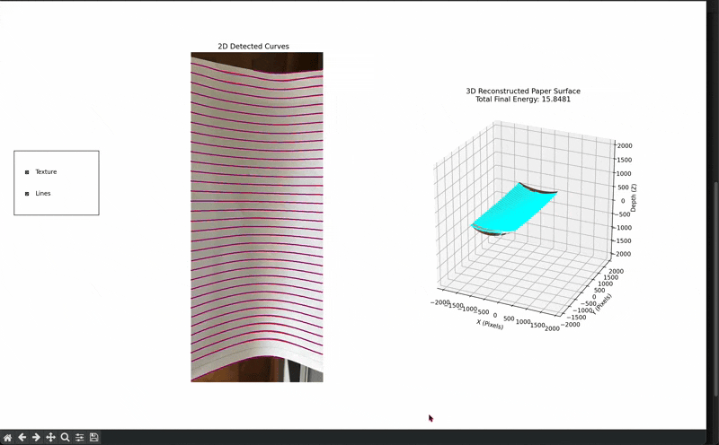
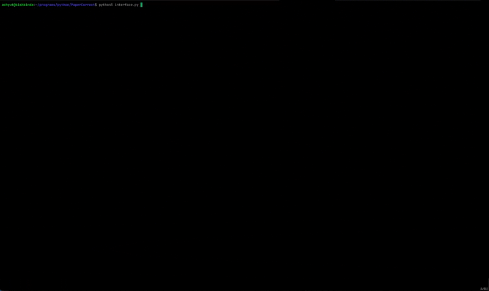
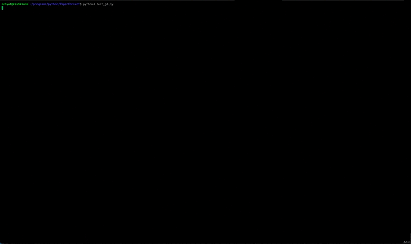

# 3D Surface Reconstruction using Geodesic Energy Minimization
[**Read the full writeup (PDF) here.**](../../releases/latest/download/report.pdf)
## Some Results

|  |  |
| ---------------------- | ------------------------ |


## The Core Algorithm

This projects uses a single photograph to reconstruct the 3D embedding of a surface with known geodesics (e.g., a ruled piece of paper which is deformed). The algorithm follows an energy minimization process on the net *geodesic energy*. 

On the highest level, the algorithm begins by *guessing* that the original surface is simply flat. If the guess turns out inaccurate, the guess is deformed in certain ways to attempt to match the true surface. 

To quantify the accuracy of a given guess, a net geodesic energy is computed. The printed straight lines on the paper are geodesics and hence have no acceleration outside the surface's (which is the paper) own bending. A photograph distorts these geodesics into curves with nonzero acceleration. Thus, computing the total acceleration (squared) of these geodesics on the guessed surface provides the required quantification and this quantity is referred to as the net geodesic energy. 

The net geodesic energy is high when the guessed surface's geometry differs significantly from the original surface geometry and is near 0 when the guessed surface resembles the original. Gradient descent then handles the choice of deformation of the guessed surface made to improve the guess. 

## Pipeline

| Stage                    | Algorithm                                                                                                                                                                                                                  | Implementation file                                                         |
| ------------------------ | -------------------------------------------------------------------------------------------------------------------------------------------------------------------------------------------------------------------------- | --------------------------------------------------------------------------- |
| **1. Edge detection**    | Gaussian blur, then adaptive thresholding to binarize the image and isolate the rulings.                                                                                                                                   | `detector/edge_detector.py`                                                 |
| **2. Curve tracing**     | Each ruling is traced into an ordered point cluster by a rotational-sweep search: a bounding rectangle pivots about each pixel and advances along the direction of lowest mean intensity.                                  | `detector/curve_trace.py`                                                   |
| **3. Spline fitting**    | Discrete point clusters are converted into analytic curves. Local quadratics are blended by a $C^k$ partition of unity, giving analytically computable first and second derivatives, and hence curvature, at any point.    | `detector/fnfit.py`                                                         |
| **4. Energy evaluation** | The geodesic energy is assembled from the fitted curves and the geometry of the current surface.                                                                                                                                    | `evaluate_penalties` in `detector/energy.py`                                |
| **5. Gradient descent**  | The guessed surface is initialized to the flat plane. The energy as a function of the discretized surface is differentiated end to end by PyTorch reverse-mode autodifferentiation, and the surface is updated until convergence or a fixed number of steps. | `run_vanilla_descent`, `run_adam_descent` in `detector/gradient_descent.py` |

## Running it

To install all requirements, run 
```bash
pip install -r requirements.txt
```

Click a picture of a ruled piece of paper and move the `.jpeg` file to the same directory as the rest of the files. To view interactive tool which displays velocity and acceleration vectors of each detected curve, run:
```bash
python3 interface.py
```


To view interactive 3D reconstruction plot, run:
```bash
python3 test_gd.py
```



